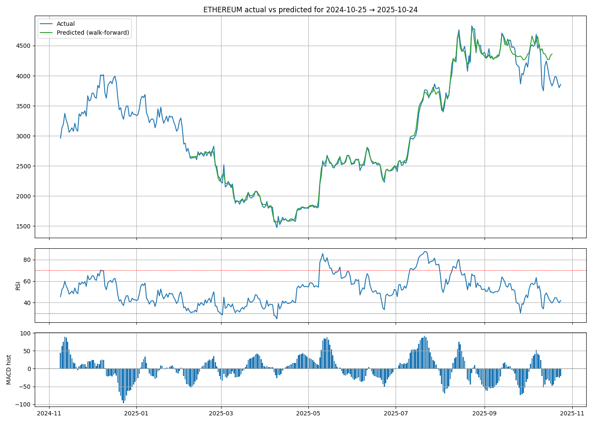

# AICryptoPrediction

**AICryptoPrediction** — Autonomous, extensible toolkit for cryptocurrency price forecasting using deep learning (LSTM/GRU/attention and Nixtla-style pipelines).  
This repository contains data fetchers (Yahoo/Coingecko fallback), feature engineering (many technical indicators), training scripts, checkpointing, walk-forward evaluation and plotting utilities.

> Put your result images in `data_deep/plots/` (or adjust paths below). This README includes image placeholders — replace them with the actual filenames you will upload to the repo.

---

## Table of contents

- [Project overview](#project-overview)  
- [Repository layout](#repository-layout)  
- [Quickstart (install & run)](#quickstart-install--run)  
- [Configuration & environment variables](#configuration--environment-variables)  
- [Data, caching & expected CSV format](#data-caching--expected-csv-format)  
- [Feature engineering & indicators](#feature-engineering--indicators)  
- [Models & training (multi_coin_trainer.py)](#models--training-multi_coin_trainerpy)  
- [Results & example images](#results--example-images)  
- [Interpreting results](#interpreting-results)  
- [Troubleshooting & tips](#troubleshooting--tips)  
- [Checkpointing & resuming training](#checkpointing--resuming-training)  
- [How to add your result images (instructions)](#how-to-add-your-result-images-instructions)  
- [Contributing](#contributing)  
- [License & acknowledgements](#license--acknowledgements)

---

## Project overview

AICryptoPrediction trains and evaluates forecasting models for crypto assets (e.g., BTC, ETH). The `multi_coin_trainer.py` file is the main entry point for deep training and iterative multi-chunk training (one-year chunks by default). The project:

- Fetches and caches daily OHLCV data (Yahoo primary, CoinGecko fallback).
- Builds a rich set of features (RSI, MACD, Bollinger Bands, ATR, many lags).
- Trains a deep sequence model with checkpointing and resume support.
- Performs walk-forward evaluation and saves plots together with CSV forecasts.
- Provides simple buy/hold/sell signals based on forecast and indicators.

---

## Repository layout
```
AICryptoPrediction/ ├── data_deep/ │   ├── cache/                  # Cached CSV chunks (gitignored) │   ├── plots/                  # Put result images here │   └── train_log.csv ├── lightning_logs/             # If using PyTorch Lightning ├── multi_coin_trainer.py       # ➜ MAIN script to run (training + eval + plotting) ├── fast_trainer.py             # CPU-optimized quick trainer ├── produce_forecast_with_model.py ├── seed_btc_from_yahoo.py ├── train_nixtla_nhits.py ├── requirements.txt ├── README.md └── .gitignore
```

> Files and folders under `data_deep/` and `models/` should be added to `.gitignore`. Large model artifacts should use Git LFS or external hosting.

---

## Quickstart (install & run)

1. Create and activate a Python virtual environment (recommended Python 3.10+):

```bash
python3 -m venv .venv
source .venv/bin/activate
pip install --upgrade pip
pip install -r requirements.txt
```

## 2. Run the main trainer (example):


`python multi_coin_trainer.py`

This will:

fetch the most recent year of data for the configured coins,

compute indicators,

train the model (or resume from a checkpoint if present),

produce walk-forward metrics,

save plots to `data_deep/plots/` and forecasts to `data_deep/`.

## Configuration & environment variables

You can set (or export) environment variables before running scripts:

`COINGECKO_API_KEY` — optional (pro key). If not set, scripts use Yahoo (yfinance) by default.

`DATA_DIR` — path to data cache (default data_deep/).

`MODEL_DIR` — path to save checkpoints (default models/).

Example:

`export COINGECKO_API_KEY="CG-xxxxxxxx"
export DATA_DIR="data_deep"
export MODEL_DIR="models"`

Do not commit .env to Git.

## Data, caching & expected CSV format

Scripts expect daily series in the following format (CSV):

`unique_id,ds,y,volume
bitcoin,2020-10-22,12965.891602,123456789
bitcoin,2020-10-23,12931.539062,98765432`
...

`unique_id` — coin id string (e.g., bitcoin).

`ds — date` (YYYY-MM-DD).

`y` — close price (float).

`volume` — daily volume.


Fetched chunks are saved in `data_deep/cache/` as `coin_YYYY-MM-DD_YYYY-MM-DD.csv`. If an API call fails or is rate-limited, the scripts will try to use the most recent cache or the Yahoo fallback.

## Interpreting results
Training loss plateau (~0.01) — could indicate label scaling, model capacity limits, or that the model reached a point where returns variance is small. Compare model MAE to a naive persistence baseline:

Persistence MAE = mean(|y_t+1 - y_t|)

If model MAE ≈ persistence MAE, the model is performing about as well as "no-change" baseline.



Divergence at the very end — common when using iterative/walk-forward predictions: errors compound when model predictions are fed back as inputs. To diagnose:

1. Evaluate teacher-forced (use true past values) vs iterative predictions — a big gap indicates error accumulation.


2. Check for a regime shift (price/volatility change) in the final window.


3. Increase training data or add regime-detection features (volatility, macro inputs).


Indicators — use RSI and MACD to decide buy/hold/sell suggestions; these are heuristic and not financial advice.

## Contributing

Contributions are welcome. Suggested workflow:

Fork the repo → create a feature branch → open a Pull Request.

Add tests for new helpers and update `README` where applicable.

Keep secrets and large binaries out of the repository.


## License & acknowledgements

License: MIT 

Acknowledgements: Nixtla (NeuralForecast / StatsForecast) concepts informed the pipeline design; thanks to the open-source ecosystem `(PyTorch, pandas, yfinance, scikit-learn)`.

# Contact
*Developer* - *Muhammad Uzzam Butt*
*Contact*   - *uzzambutt1@outlook.com*
