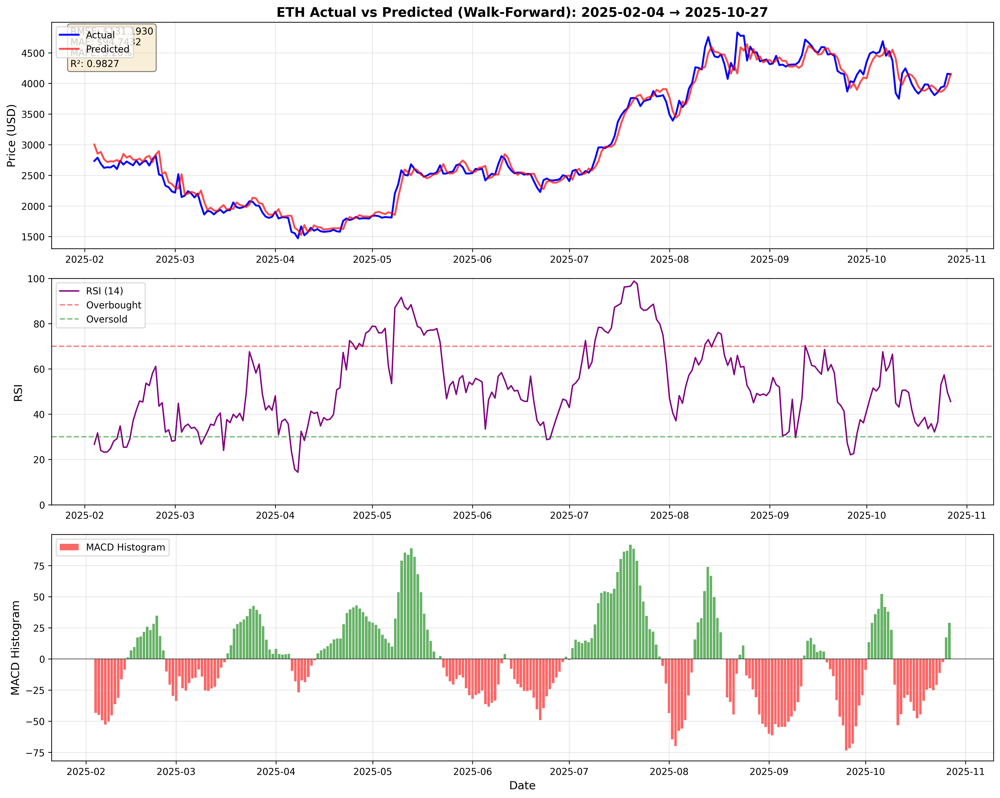
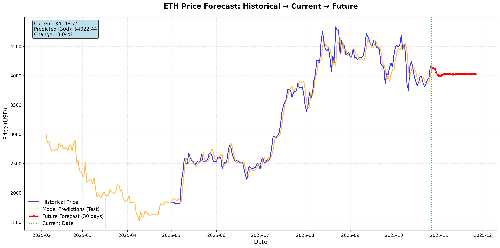

# 🚀 Multi-Cryptocurrency Price Forecasting System

[](https://www.python.org/downloads/)
[](https://pytorch.org/)
[](https://opensource.org/licenses/MIT)

A production-ready deep learning system for predicting cryptocurrency prices using LSTM neural networks with 70+ technical indicators. Features multi-coin support, ensemble forecasting, and customizable indicator visualization.

## ✨ Features

### 🎯 Core Capabilities
- **20+ Supported Cryptocurrencies**: BTC, ETH, BNB, SOL, ADA, DOGE, XRP, and more
- **Deep LSTM Architecture**: 3-layer (128→256→128) with dropout regularization
- **70+ Technical Indicators**: RSI, MACD, Bollinger Bands, Moving Averages, Volume indicators, etc.
- **Ensemble Forecasting**: Monte Carlo simulations with confidence intervals
- **Walk-Forward Validation**: Realistic out-of-sample performance testing
- **Multi-Coin Training**: Sequential training with automatic GPU memory management

### 📊 Triple Visualization System
1. **Standard Forecast Chart**: Historical vs Predicted prices with RSI and MACD
2. **Future Prediction Chart**: 30-day ahead forecast with confidence intervals
3. **Custom Indicator Chart**: User-selected technical indicators

### 🛠️ Production Features
- Automatic checkpointing and resumable training
- Data caching for faster iterations
- Comprehensive error handling and logging
- GPU/MPS/CPU auto-detection
- Interactive and non-interactive modes

## 📸 Example Results

### Future Price Forecast

*Ethereum 30-day price forecast with 95% confidence intervals. The model predicts a -3.04% change from current price.*

### Custom Technical Indicators

*Custom visualization showing price with RSI, MACD, Stochastic Oscillator, Bollinger Bands, Moving Averages, Volume, and more.*

### Standard Performance Chart

*Walk-forward validation showing actual vs predicted prices with key performance metrics (RMSE, MAE, R²).*

## 🚀 Quick Start

### Prerequisites
```bash
Python 3.8+
CUDA-capable GPU (optional, but recommended)
```

### Installation

```bash
# Clone the repository
git clone https://github.com/uzzambutt/crypto-forecaster.git
cd crypto-forecaster

# Install dependencies
pip install torch pandas numpy matplotlib yfinance scikit-learn tqdm
```

### Basic Usage

```bash
# Train single coin (interactive mode - asks for indicators)
python crypto_forecaster.py --coin ETH

# Train with specific forecast period
python crypto_forecaster.py --coin BTC --days 60

# Non-interactive mode (skip indicator selection)
python crypto_forecaster.py --coin BTC --no-interactive

# Train multiple coins
python crypto_forecaster.py --coins BTC ETH SOL BNB --days 30

# Train all supported coins
python crypto_forecaster.py --all --days 7

# List available cryptocurrencies
python crypto_forecaster.py --list
```

## 📖 Detailed Usage

### Command-Line Arguments

| Argument | Description | Example |
|----------|-------------|---------|
| `--coin` | Single cryptocurrency to train | `--coin ETH` |
| `--coins` | Multiple cryptocurrencies | `--coins BTC ETH SOL` |
| `--all` | Train all 20+ supported coins | `--all` |
| `--days` | Future prediction window (1-365) | `--days 60` |
| `--no-interactive` | Skip indicator selection | `--no-interactive` |
| `--list` | Show all supported coins | `--list` |

### Interactive Indicator Selection

When running in interactive mode, you'll be prompted to select technical indicators:

```
INDICATOR SELECTION FOR CUSTOM CHART
================================================================================

Available Indicators:
  1. RSI          - Relative Strength Index
  2. MACD         - MACD Histogram
  3. Stochastic   - Stochastic Oscillator
  4. BB           - Bollinger Bands
  5. SMA          - Simple Moving Averages
  6. EMA          - Exponential Moving Averages
  7. Volume       - Volume Analysis
  8. ATR          - Average True Range
  9. OBV          - On-Balance Volume
  10. Williams    - Williams %R

Options:
  - Enter numbers separated by commas (e.g., 1,2,5)
  - Enter 'all' to include all indicators
  - Enter 'none' or press Enter to skip custom chart

Your selection: 1,2,3,4
```

## 🎨 Available Technical Indicators

### Trend Indicators
- **SMA** (Simple Moving Average): 20, 50, 100, 200 periods
- **EMA** (Exponential Moving Average): 12, 26, 50, 100 periods
- **MACD** (Moving Average Convergence Divergence): Line, Signal, Histogram
- **Bollinger Bands**: Upper, Middle, Lower bands with bandwidth
- **Parabolic SAR**: Stop and Reverse points

### Momentum Indicators
- **RSI** (Relative Strength Index): 14-period with overbought/oversold zones
- **Stochastic Oscillator**: %K and %D lines
- **Williams %R**: 14-period momentum indicator
- **Momentum**: 10-period price momentum
- **ROC** (Rate of Change): Percentage price change

### Volatility Indicators
- **ATR** (Average True Range): 14-period volatility
- **True Range**: High-low price range
- **Standard Deviation**: Rolling returns volatility

### Volume Indicators
- **OBV** (On-Balance Volume): Cumulative volume flow
- **CMF** (Chaikin Money Flow): 20-period money flow
- **A/D Line** (Accumulation/Distribution): Volume-weighted price movement

### Price-Based Features
- Log returns and percentage returns
- Rolling mean and standard deviation (5, 10, 20 periods)
- 30 lag features for temporal dependencies

## 📁 Output Files

Each trained cryptocurrency generates the following files:

```
project/
├── btc_forecast.png              # Standard 3-panel performance chart
├── btc_future_forecast.png       # Future price prediction with confidence
├── btc_indicators_only.png       # Custom indicator visualization (if selected)
├── predictions_btc.csv           # Test set predictions
├── future_predictions_btc.csv    # Future forecasts with confidence bounds
├── training_summary_btc.json     # Complete training metrics
├── btc_data.csv                  # Cached price data
├── checkpoints/btc/
│   ├── best_btc_model.pth       # Trained model weights
│   ├── feature_scaler.pkl       # Feature normalization scaler
│   └── target_scaler.pkl        # Target normalization scaler
└── train_log.txt                 # Execution logs
```

For multi-coin training, an additional `multi_coin_summary.json` is generated.

## 🎯 Model Architecture

### LSTM Network
```
Input Layer (70+ features)
    ↓
LSTM Layer 1 (128 units) + Dropout (0.2)
    ↓
LSTM Layer 2 (256 units) + Dropout (0.2)
    ↓
LSTM Layer 3 (128 units) + Dropout (0.2)
    ↓
Dense Layer (1 unit - price prediction)
```

### Training Configuration
- **Sequence Length**: 60 days
- **Batch Size**: 32
- **Optimizer**: AdamW with cosine annealing
- **Learning Rate**: 1e-3
- **Early Stopping**: 100 epochs patience
- **Gradient Clipping**: Max norm 1.0
- **Train/Val Split**: 80/20

## 📊 Performance Metrics

The system evaluates models using:

- **RMSE** (Root Mean Squared Error): Average prediction error magnitude
- **MAE** (Mean Absolute Error): Average absolute prediction error
- **MAPE** (Mean Absolute Percentage Error): Percentage error metric
- **R²** (R-squared): Proportion of variance explained

Example output:
```
ETH TRAINING SUMMARY
================================================================================
Best Validation Loss: 0.001234
Test RMSE: $45.67
Test MAE: $32.15
Test MAPE: 1.23%
Test R²: 0.9856
Current Price: $3,980.19
Predicted Price (30d): $3,844.02
Expected Change: -3.42%
================================================================================
```

## 🔄 Ensemble Forecasting

Future predictions use Monte Carlo ensemble forecasting:

1. **Multiple Simulations**: Runs 5 independent forecast paths
2. **Stochastic Volatility**: Adds realistic price variations based on historical volatility
3. **Trend Continuation**: Extrapolates recent 7-day momentum
4. **Ensemble Average**: Combines simulations for robust predictions
5. **Confidence Intervals**: 95% prediction bounds from simulation variance

This approach prevents flat predictions and provides uncertainty quantification.

## 💾 Supported Cryptocurrencies

| Symbol | Name | Symbol | Name |
|--------|------|--------|------|
| BTC | Bitcoin | LINK | Chainlink |
| ETH | Ethereum | UNI | Uniswap |
| BNB | Binance Coin | ATOM | Cosmos |
| SOL | Solana | LTC | Litecoin |
| ADA | Cardano | ETC | Ethereum Classic |
| DOGE | Dogecoin | XLM | Stellar |
| XRP | Ripple | ALGO | Algorand |
| MATIC | Polygon | VET | VeChain |
| DOT | Polkadot | ICP | Internet Computer |
| AVAX | Avalanche | FIL | Filecoin |

## 🛠️ Advanced Usage

### Resume Training

The system automatically saves checkpoints. If training is interrupted, simply rerun the same command to resume:

```bash
# Training interrupted at epoch 150
python crypto_forecaster.py --coin BTC

# Output: "Resumed BTC from checkpoint at epoch 151"
```

### Batch Processing

Train multiple coins overnight:

```bash
# Short-term forecasts for trading
python crypto_forecaster.py --coins BTC ETH BNB SOL ADA --days 7

# Medium-term forecasts for investment
python crypto_forecaster.py --all --days 30 --no-interactive

# Long-term forecasts
python crypto_forecaster.py --coins BTC ETH --days 90
```

### Clear Cache and Retrain

```bash
# Remove all cached data and models
rm -rf checkpoints/ *.csv *.png *.json

# Fresh training
python crypto_forecaster.py --coin ETH
```

## 📈 Use Cases

### Trading
- **7-day forecasts** for short-term position planning
- **RSI and MACD** for entry/exit signals
- **Confidence intervals** for risk assessment

### Investment
- **30-90 day forecasts** for medium-term strategy
- **Multiple coin comparison** for portfolio allocation
- **Trend analysis** with moving averages

### Research
- **Model comparison** across different cryptocurrencies
- **Indicator effectiveness** analysis
- **Volatility patterns** and market dynamics

## ⚙️ Configuration

Edit `CONFIG_TEMPLATE` in the script to customize:

```python
CONFIG_TEMPLATE = {
    'lookback_years': 5,          # Historical data window
    'sequence_length': 60,         # LSTM input window (days)
    'train_split': 0.8,           # Train/validation split
    'batch_size': 32,             # Training batch size
    'hidden_sizes': [128, 256, 128],  # LSTM layer sizes
    'dropout': 0.2,               # Dropout rate
    'learning_rate': 1e-3,        # Initial learning rate
    'max_epochs': 10000,          # Maximum training epochs
    'early_stop_patience': 100,   # Early stopping patience
    'gradient_clip': 1.0,         # Gradient clipping threshold
}
```

## 🐛 Troubleshooting

### Common Issues

**Issue**: `yfinance not installed`
```bash
pip install yfinance
```

**Issue**: CUDA out of memory
```bash
# Reduce batch size in CONFIG_TEMPLATE
'batch_size': 16  # or 8
```

**Issue**: Flat predictions
```bash
# Delete checkpoints and retrain with latest code
rm -rf checkpoints/
python crypto_forecaster.py --coin BTC
```

**Issue**: Import errors
```bash
# Reinstall dependencies
pip install --upgrade torch pandas numpy matplotlib scikit-learn tqdm
```

## 📝 Citation

If you use this system in your research or projects, please cite:

```bibtex
@software{crypto_forecaster_2025,
  title = {Multi-Cryptocurrency Price Forecasting System},
  author = {Muhammad Uzzam Butt},
  year = {2025},
  url = {https://github.com/uzzambutt/crypto-forecaster}
}
```

## 🤝 Contributing

Contributions are welcome! Areas for improvement:

- Additional cryptocurrencies
- More technical indicators (Ichimoku, Fibonacci, etc.)
- Alternative models (Transformer, GRU, Attention mechanisms)
- Real-time prediction API
- Backtesting framework
- Portfolio optimization features

## ⚠️ Disclaimer

**This software is for educational and research purposes only.**

- Cryptocurrency trading involves substantial risk of loss
- Past performance does not guarantee future results
- The predictions are probabilistic estimates, not certainties
- Always do your own research (DYOR)
- Never invest more than you can afford to lose
- Consult with financial advisors before making investment decisions

## 📜 License

This project is licensed under the MIT License - see the [LICENSE](LICENSE) file for details.

## 🙏 Acknowledgments

- Yahoo Finance for data API
- PyTorch team for the deep learning framework
- The open-source cryptocurrency community

## 📞 Support

For issues, questions, or suggestions:
- Open an [Issue](https://github.com/uzzambutt/AICryptoPrediction/issues)
- Submit a [Pull Request](https://github.com/uzzambutt/AICryptoPrediction/pulls)

---

**Made with ❤️ by Muhammad Uzzam Butt** | **Star ⭐ this repo if you find it useful!**
